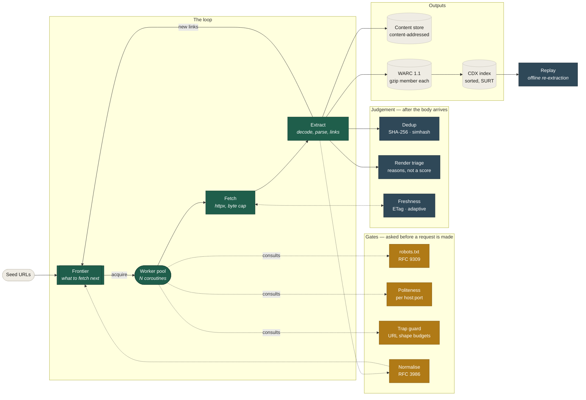
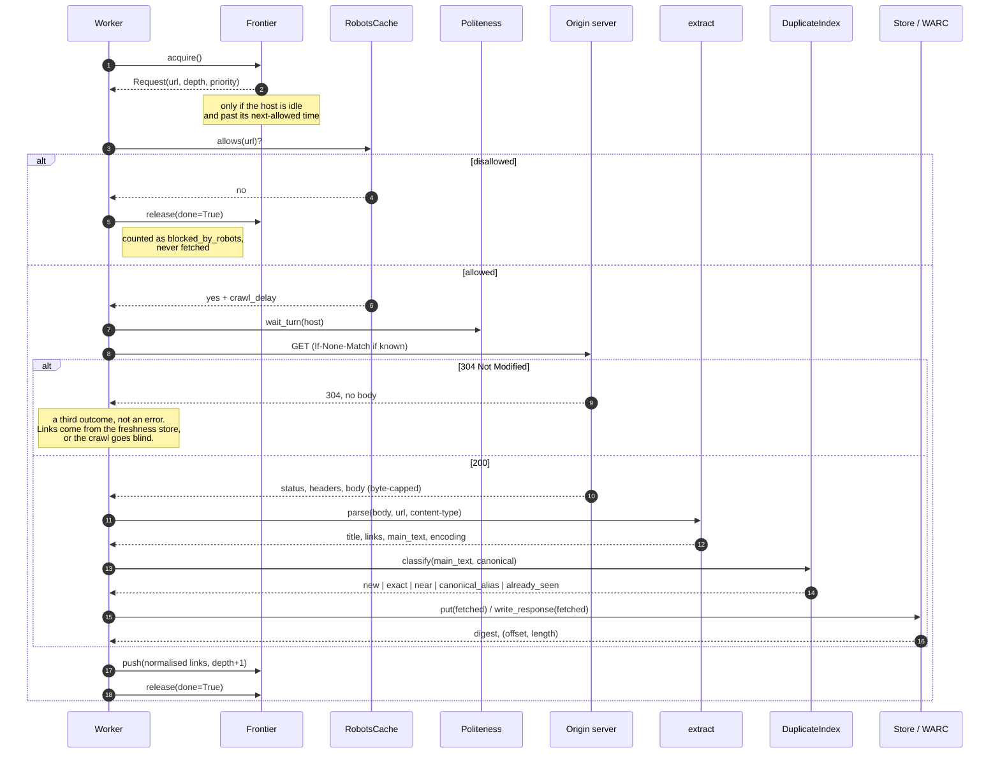

# minicrawl

A web crawler built from scratch in Python, one concept at a time, against a
synthetic corpus engineered to punish every shortcut.

The point is not to produce another crawler — Scrapy exists. The point is that
by the end you can read Scrapy's source and recognise every piece of it,
because you wrote a worse version of each one first.

## Two kinds of notes

`docs/stage-NN.md` is **why** — narrative rationale, the judgement calls, the
rules that had to be taken back out. Read it to understand a decision.

`logs/stage-NN/notes.txt` is **what and how** — the steps in the order they
happened, the concepts stated independently of this codebase, and an explicit
concept → code map naming the file and function each idea is made of. Read it
to study the theory or to retrace the work. Every stage gets one, written as
the stage lands.

## The ladder — complete

Sixteen stages, sixteen tags, 296 tests. Each stage is a git tag, a rationale note in
`docs/`, and a working log in `logs/`. Nothing was checked in until it verified
against the ground-truth manifest.

| Stage | Adds | Concept it proves |
|------:|------|-------------------|
| 1 ✅ | `fetch.py`, `extract.py` | HTTP semantics, body caps, `<base href>`, URL resolution + validation |
| 2 ✅ | `crawler.py`, `frontier/memory.py` | The crawl loop, BFS, cycle avoidance, scope |
| 3 ✅ | `robots.py`, `politeness.py` | robots.txt (hand-rolled), crawl-delay, per-host rate limits |
| 4 ✅ | `frontier/hosted.py`, worker pool | Concurrency that does not become a DoS |
| 5 ✅ | `normalize.py`, `traps.py`, `frontier/sqlite.py` | Canonicalisation, dedup, resumable crawls, trap defence |
| 6 ✅ | `dedup.py`, `main_text()` | Boilerplate removal, exact + near-dup (simhash), canonical |
| 7 ✅ | `render.py` | Escalating to Playwright *only* for pages that need it |
| 8 ✅ | `freshness.py`, `sitemap.py`, `PriorityQueue` | Conditional GET, recrawl scheduling, priority frontier |
| 9 ✅ | `frontier/redis.py` | Distributed coordination, leases, shared politeness |
| 10 ✅ | `scrapy_port/`, `scripts/compare_frameworks.py` | What the framework actually buys you |
| 11 ✅ | `store.py`, `warc.py` | Content addressing, WARC archives, provenance |
| 12 ✅ | `cdx.py`, `replay.py` | SURT, binary search on disk, replay with the origin gone |
| 13 ✅ | `web/`, `charset.py` | A browser front end, and the real web finding a twelve-stage bug |
| 14 ✅ | `web/policy.py`, `Dockerfile` | Exposing it publicly: SSRF, rate limits, fail-safe defaults |
| 15 ✅ | `export.py`, `report.html` | Getting the crawl out: JSONL text, a self-contained report, bundles |
| 16 ✅ | `reader.py`, `markdown.py` | Reader mode: one URL in, Markdown out, and why a read beats a crawl |

## Design

The full write-up — ten diagrams, high- and low-level — is in
**[docs/design.md](docs/design.md)**. The two that matter most:

### What the pieces are

A crawler is a loop with a queue in the middle. Everything else is a defence
against the ways that loop goes wrong: the same page under fourteen names, a
server that generates pages forever, a site that asks you to slow down, a
document you already have.



Three boundaries do real work. The **frontier is an interface**, so persistence
and distribution are storage choices rather than rewrites. The **gates run
before the request**, because a check after the fetch is an audit, not a
defence. And the **outputs are downstream of extraction**, so a crawl with a
store behaves identically to one without — `NullStore` exists to make that
literal.

### What happens to one URL



`release(done=...)` is not a formality: hitting `max_pages` while holding a
request must release it as *unfinished*, or a resumed crawl skips it forever.
And a 304 has no body, so it has no links — the freshness store keeps outlinks
for exactly that reason, or caching turns a 27-page crawl into a 10-page one.

## See it without installing anything

**[dipan010.github.io/minicrawl →](https://dipan010.github.io/minicrawl/)**

Pick a crawl and press Replay: four real crawls were recorded with the moment
each page arrived, and the page plays them back at the same pace — including
the waiting, which is most of a polite crawl. Below that, a report generated by
running the crawler: the ground-truth diff, what robots.txt
did on four hosts, the duplicate pairs, the WARC archive, an interactive binary
search over the real CDX index, and the bug the real web found. Every figure on
it comes from `scripts/dashboard_data.py` — nothing is typed in, so nothing can
drift from the code.

```bash
uv run python scripts/dashboard_data.py > docs/dashboard.json   # the figures
# docs/index.html embeds that JSON and is what GitHub Pages serves
```

## Watch it work

```bash
uv run python -m testsite.server &     # the practice corpus
uv run minicrawl-web                   # opens http://127.0.0.1:8000/
```

Type a URL — the local corpus, or any real site — and the pages stream in as
they are fetched.

### Read a single page

```bash
uv run minicrawl-read https://example.com/            # Markdown on stdout
uv run minicrawl-read --json url1 url2 > pages.jsonl  # for a pipeline
```

The shape an LLM agent calls: fetch, strip the furniture, return Markdown with
its structure intact. **Eight real pages in 1.88s**, robots obeyed — against
8.10s to crawl the same number. The gap is politeness, not optimisation: a
crawl visits one host repeatedly and must wait between requests; a read is
handed a list and never queues per host. `scripts/reader_bench.py` measures
both, and reports the robots.txt cost separately rather than hiding it.

### Or host it

```bash
docker build -t minicrawl-demo . && docker run --rm -p 8000:8000 minicrawl-demo
```

`render.yaml` deploys the same image. A hosted instance runs under a different
policy from a local one (`MINICRAWL_PUBLIC=1`): it crawls a fixed list of
sites that exist to be crawled, refuses loopback and private addresses,
resolves hostnames before trusting them, and rate-limits per visitor. A URL box
on a public host is a request forwarder aimed at whoever a stranger picks —
`docs/stage-14.md` is the long version of why. The crawl runs in Python; the browser only watches it, because
a page cannot read another origin's HTML (CORS), which is the same reason every
crawler you have used is a server process.

robots.txt is always obeyed there and cannot be switched off from the form. The
CLI has `--ignore-robots` because a human running it owns the consequences; a
form on a web page does not.

## Run it

`uv sync` is exact: each invocation installs precisely the extras you name and
**uninstalls everything else**. So name them together, or use `--all-extras`.

```bash
# everything, including the optional stages 7, 9 and 10
uv sync --all-extras

# or just the core crawler and its tests (stages 1-6, 8)
uv sync --extra dev

# stage 7 needs a browser as well (~150MB, one time)
uv run playwright install chromium

# terminal 1 — the corpus, on four origins
uv run python -m testsite.server

# terminal 2 — crawl it, and diff against ground truth
uv run minicrawl http://127.0.0.1:8081/ --max-pages 40 --verify

# concurrency across hosts, politeness within each one.
# --no-dedup because the four origins serve the SAME corpus: with stage 6 on,
# hosts 2 and 4 are correctly identified as duplicates of host 1 and their
# links are suppressed, which is right but leaves little to be concurrent about.
uv run minicrawl http://127.0.0.1:808{1,2,4}/ --workers 8 --max-pages 60 --no-dedup

# a resumable crawl: interrupt it, run it again, it picks up where it stopped
uv run minicrawl http://127.0.0.1:8081/ --frontier crawl.sqlite3 --verify

# escalate to a browser only where triage says it would help (1 page in 26)
uv run minicrawl http://127.0.0.1:8081/ --render

# sitemaps + conditional GET: run it three times and watch the bytes vanish
uv run minicrawl http://127.0.0.1:8081/ --sitemaps --freshness fresh.sqlite3

# one crawl split across three processes, coordinating only through Redis
docker run -d --rm --name minicrawl-redis -p 6379:6379 redis:7-alpine
uv run python scripts/distributed_demo.py 3

# keep what it fetches: 23 objects for 27 URLs, plus a replayable archive
uv run minicrawl http://127.0.0.1:8081/ --store ./store --warc ./crawl.warc.gz

# index the archive, then kill the server and re-extract every link offline
uv run minicrawl http://127.0.0.1:8081/ --warc ./c.warc.gz --cdx ./c.cdxj
pkill -f testsite.server
uv run python -c "
from minicrawl.replay import ArchiveReplay
r = ArchiveReplay('c.warc.gz', 'c.cdxj')
print(sum(len(r.links(u) or []) for u in r.urls()), 'links, nothing listening')"

# the punchline: this crawler vs Scrapy, same corpus, every number measured
uv run python scripts/compare_frameworks.py

uv run pytest -q            # 151 tests; browser and Redis tests skip if absent
```

Every optional dependency is genuinely optional. Without Playwright, Redis or
Scrapy the suite still runs — those tests skip and say why.

## Layout

```
minicrawl/            the crawler
  fetch.py            one HTTP request: streaming, byte-capped, errors as data
  extract.py          links (base href, relative, validated) and main text
  normalize.py        canonical URLs, and the rules deliberately left out
  robots.py           RFC 9309, hand-rolled
  politeness.py       the per-host clock
  traps.py            URL-shape budgets, for sites that generate pages at you
  dedup.py            content hash, simhash, banded near-duplicate index
  render.py           triage first, headless browser only if it would help
  freshness.py        validators, change detection, adaptive recrawl schedule
  sitemap.py          index and urlset, tolerant of malformed XML
  store.py            content-addressed objects, and an index over them
  warc.py             WARC 1.1 archives, one gzip member per record
  charset.py          BOM, header, meta, then the fallback that cannot fail
  export.py           JSONL of clean text, and a report you can carry away
  reader.py           one URL in, Markdown out — no frontier, no queue
  markdown.py         HTML to Markdown, structure kept, links absolutised
  report.html         the report template — system fonts, no network
  cdx.py              SURT keys, sorted CDXJ, binary search over the file
  replay.py           seek to a record, re-extract with no network
  crawler.py          the loop, and the worker pool over it
  cli.py              the command line
  web/
    server.py         asyncio HTTP + server-sent events, no framework
    index.html        the page: no build step, no dependencies
  frontier/
    base.py           Request, and the Frontier protocol
    scheduling.py     readiness clock, one-per-host guard, termination
    memory.py         deque (FIFO) and heap (priority) queues
    hosted.py         in-memory, partitioned by host
    sqlite.py         durable and resumable
    redis.py          shared across processes, with leases

testsite/             the corpus — the measuring instrument
  spec.py             the whole site declared as data. Edit this, never the JSON
  server.py           serves it on four origins
  manifest.py         derives ground truth from spec.py, with no HTTP at all
  manifest.json       generated; the file every crawl is diffed against

docs/stage-NN.md      why each stage is designed the way it is
logs/stage-NN/        how it was built, and which code each concept lives in
scripts/              the two multi-process demos
scrapy_port/          the same crawl written against Scrapy, for stage 10
tests/                151 tests, named by the stage they pin
```

## The corpus

Four origins, all serving the same declared site, because per-host politeness
and host sharding cannot be demonstrated against one:

| Origin | Its job |
|---|---|
| `:8081` | the main corpus. `robots.txt` with rules, an `Allow:` exception, `Crawl-delay: 0.2` |
| `:8082` | `robots.txt` answers **404** — RFC 9309 says crawl freely |
| `:8083` | `robots.txt` answers **500** — RFC 9309 says assume a total ban |
| `:8084` | `Disallow: /gen/` — the trap closed by robots alone |

`docs/testsite.md` lists every pathology in it and the stage each one targets:
redirect chains and loops, 14 spellings of one URL, exact and near duplicates, a
page only JavaScript can reach, a page nothing links to, a page that changes on
every request, and an unbounded generator.

## Command line

```
minicrawl SEED [SEED ...] [options]
```

| Flag | What it turns on | Stage |
|---|---|---|
| `--verify` | diff the crawl against `testsite/manifest.json` | 2 |
| `--max-pages`, `--max-depth`, `--timeout` | the caps | 2 |
| `--all-hosts` | leave the seed origins | 2 |
| `--ignore-robots`, `--delay` | robots and per-host rate limiting | 3 |
| `--workers N` | concurrent workers, shared across hosts | 4 |
| `--frontier PATH` | durable SQLite frontier; re-run to resume | 5 |
| `--no-normalize`, `--no-traps` | switch off canonicalisation / trap defence | 5 |
| `--no-dedup` | switch off content duplicate detection | 6 |
| `--render` | escalate JS-dependent pages to a headless browser | 7 |
| `--sitemaps` | read sitemaps as a second seed source | 8 |
| `--freshness PATH` | conditional GET and recrawl scheduling across runs | 8 |
| `--priority` | order the frontier by priority instead of arrival | 8 |
| `--redis [URL]`, `--redis-prefix` | share the frontier across processes | 9 |
| `--store DIR` | content-addressed store: one object per distinct body | 11 |
| `--warc PATH` | write a gzip-member WARC 1.1 archive | 11 |
| `--cdx PATH` | write a sorted CDXJ index of that archive | 12 |
| `--export PATH` | one JSON object per page, with clean text (JSONL) | 15 |
| `--report PATH` | a self-contained HTML report of this crawl | 15 |
| `--bundle PATH` | zip the report, the text and any archive together | 15 |
| `--quiet` | suppress the per-page log | — |

The `--no-*` flags exist so each stage's contribution can be switched off and
measured, which is how most of the numbers in `docs/` were produced.

## How correctness is decided

`testsite/spec.py` declares the corpus: the page graph, the robots rules, which
URLs are spellings of the same resource, which pages are duplicates, which are
JS-only. `testsite/manifest.py` walks that declaration — no HTTP, no HTML
parsing — and writes `testsite/manifest.json`. Its headline entry is `expected_pages`: the
**21 pages** a polite, same-host crawl from `/` must find, exactly. Two more
entries cover the configurations that reach further —
`expected_pages_rendered` and `expected_pages_with_sitemaps` are 22 each,
because a browser and a sitemap each unlock one page nothing links to.

The crawler has to reach the same answer the hard way. That gap is the test.

Today, at `HEAD`:

```
expected 21 pages, covered 24 on 127.0.0.1:8081
bounded     3 trap pages under /gen/ — capped, not excluded
exact match against the manifest
                          ... stopped: frontier drained
```

`frontier drained` is the point: the crawl ended because it ran out of graph,
not because a cap stopped it. The 3 remaining trap pages are bounded rather
than absent — a general defence can cap a generator, it cannot know to exclude
one.

The corpus grows when a stage needs a case it cannot otherwise reach — 19
pages originally, 20 when `/volatile` arrived at stage 8, 21 when
`/compressed` arrived at stage 11. Earlier figures reproduce at their own tags
(`git checkout stage-02`):

```
stage-02   expected 19, crawled 32   0 missing, 13 extra   stopped: max_pages
stage-05   expected 19, crawled 24   5 trap pages bounded  stopped: frontier drained
```

## The punchline

`scripts/compare_frameworks.py` runs this crawler and a Scrapy port of it
against the same corpus:

```
                            reqs  pages  /gen  /a spellings   secs
minicrawl (stage 5)           29     29     5             2    6.5
scrapy (defaults)            247    246   223             4    1.8
scrapy + minicrawl.traps      25     24     3             2    1.1
```

(The Scrapy row drifts a few pages between runs; `CLOSESPIDER_PAGECOUNT` stops
the spider with requests still in flight.)

Both find every expected page. Scrapy is faster because minicrawl is slower on
purpose — it honours the `Crawl-delay: 0.2` the site states, which Scrapy never
reads. Against a site asking for 49 seconds of spacing, the default spider took
1.8. And where `robots.txt` answers HTTP 500, RFC 9309 says assume a complete
disallow: minicrawl fetches 0 pages, Scrapy fetches around 250.

None of that is a bug in Scrapy. Each is a default doing what it says, and
noticing them is the whole point of having built the thing once. See
`docs/stage-10.md`.

## Known gaps, on purpose

`tests/test_stage02_bfs.py` ends with `test_characterises_*` tests that assert
the crawler's *current* failures — no URL normalisation, walks into the
generator trap. Each one is designed to break when the stage that fixes it
lands. Flipping a characterisation test is the definition of done for a stage.

All three have now been flipped:

| Asserted at stage 2 | Flipped by | Now asserts |
|---|---|---|
| `no_robots_support_yet` | stage 3 | `test_disallowed_pages_are_never_fetched` |
| `no_url_normalisation_yet` | stage 5 | `test_fourteen_spellings_of_a_become_three_fetches` |
| `generator_trap_is_entered` | stage 5 | `test_generator_trap_is_bounded` |

## Reading order

If you are here to study rather than to run it:

1. `logs/README.txt` — the index, and which `WHAT BROKE` sections are worth
   reading on their own.
2. `logs/stage-01/notes.txt` onward — each has a **concept → code map** naming
   the file and function every idea is implemented by.
3. `docs/testsite.md` — the corpus, and what each pathology is there to catch.
4. `docs/stage-10.md` — what a mature framework gives you, and what it doesn't.

`git diff stage-04 stage-05` and its siblings show exactly what each stage
changed, and `git show stage-05` carries the reasoning in the tag message.

## What this is not

Not a crawler you should use. Scrapy is more capable, better tested and free,
and `docs/stage-10.md` makes that case with numbers rather than modesty.

Stages 11 and 12 give it an archive it can write, index and read back — but
not byte-exact provenance: httpx has already decoded the response by the time
`fetch` returns, so the wire bytes are gone, and the record says so rather than
pretending otherwise. A repeat capture of an unchanged page still writes a full
response record instead of a WARC `revisit` pointing at the first, and there is
no CDX *server* — the index is a file and a library, not an endpoint. The
corpus is synthetic, so nothing here has met a real site's malformed markup,
hostile rate limiting or TLS quirks.

It is a teaching artifact with a test suite, and the claim it makes is narrow:
every idea in it was built, measured against declared ground truth, and written
down — including the parts that were wrong first.

## Licence

MIT. The corpus, the docs and the logs are part of it.
