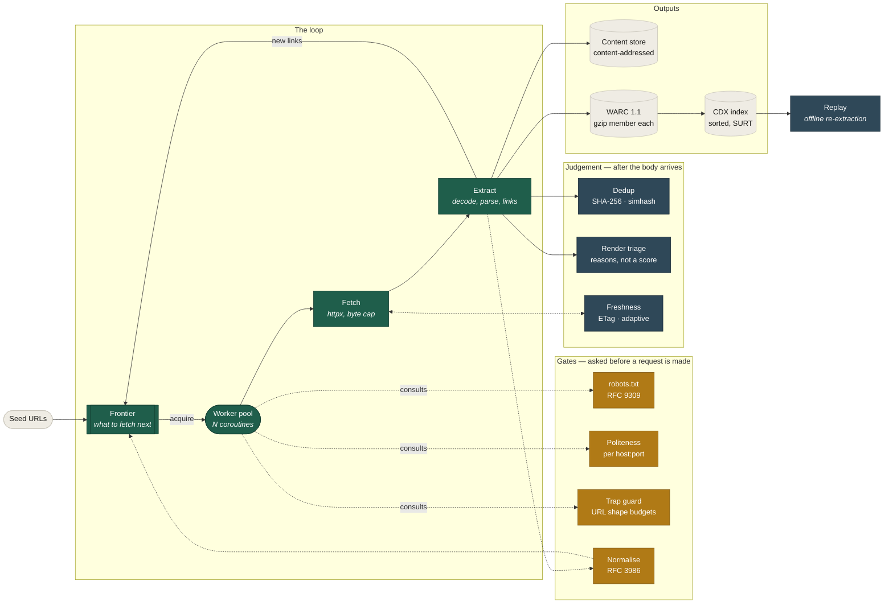
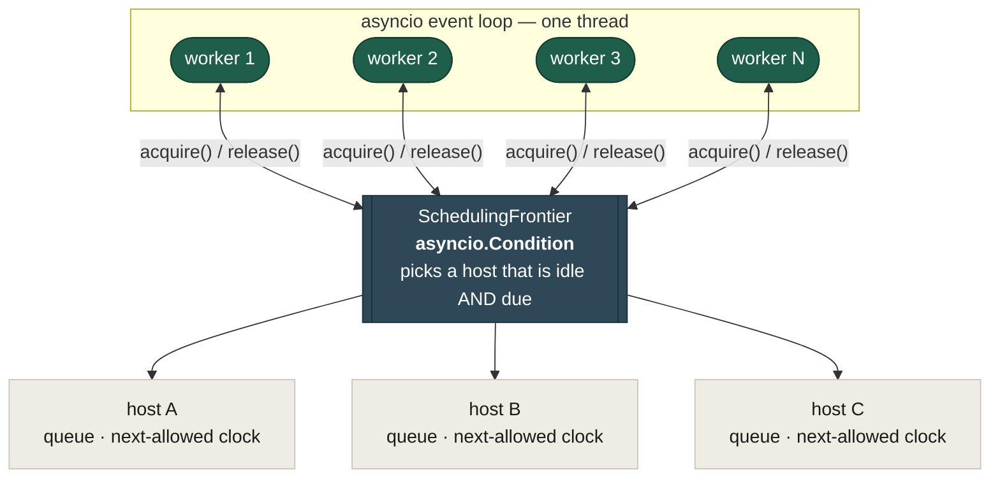
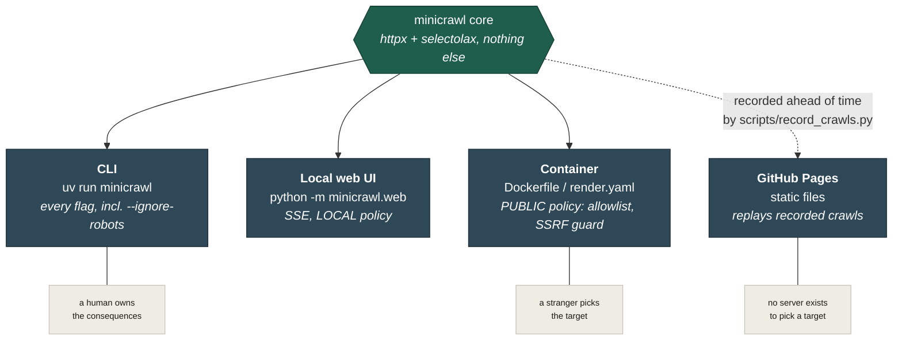
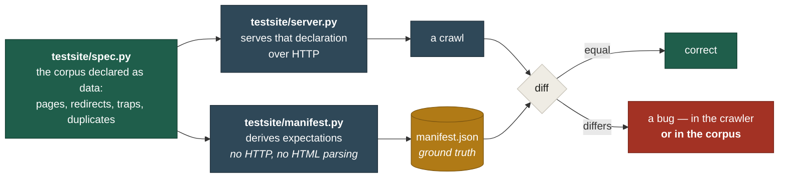
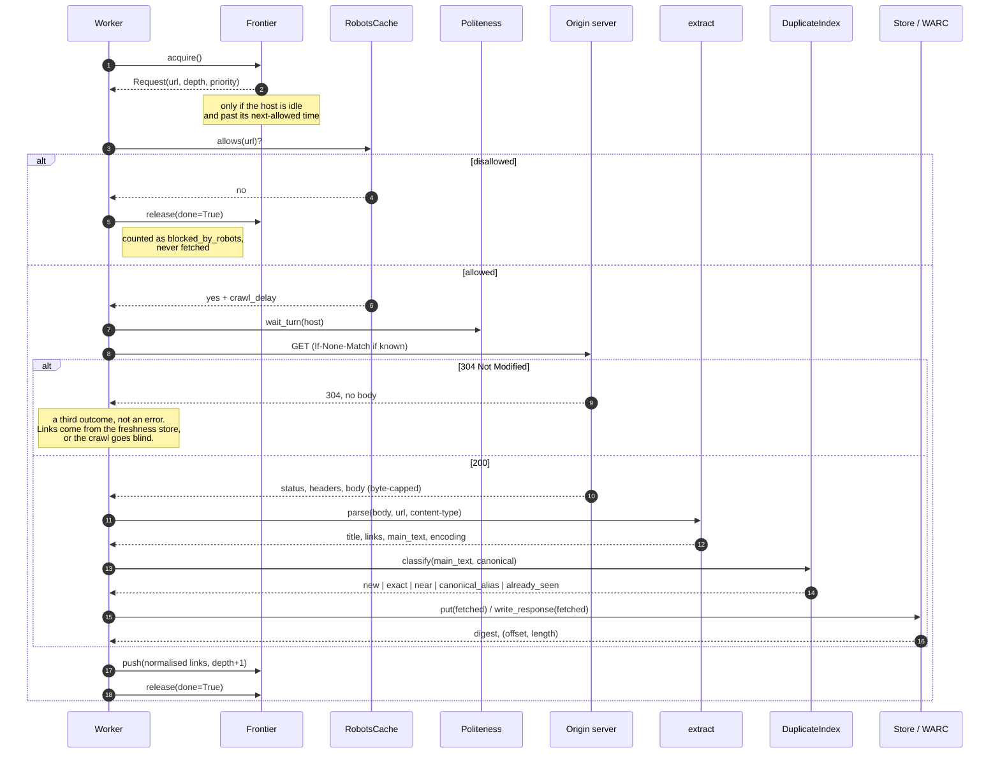
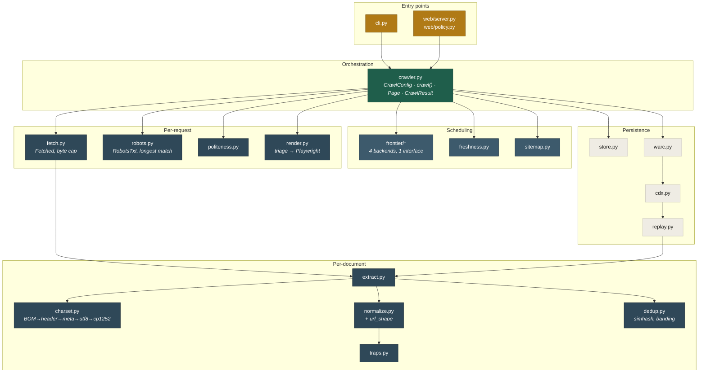
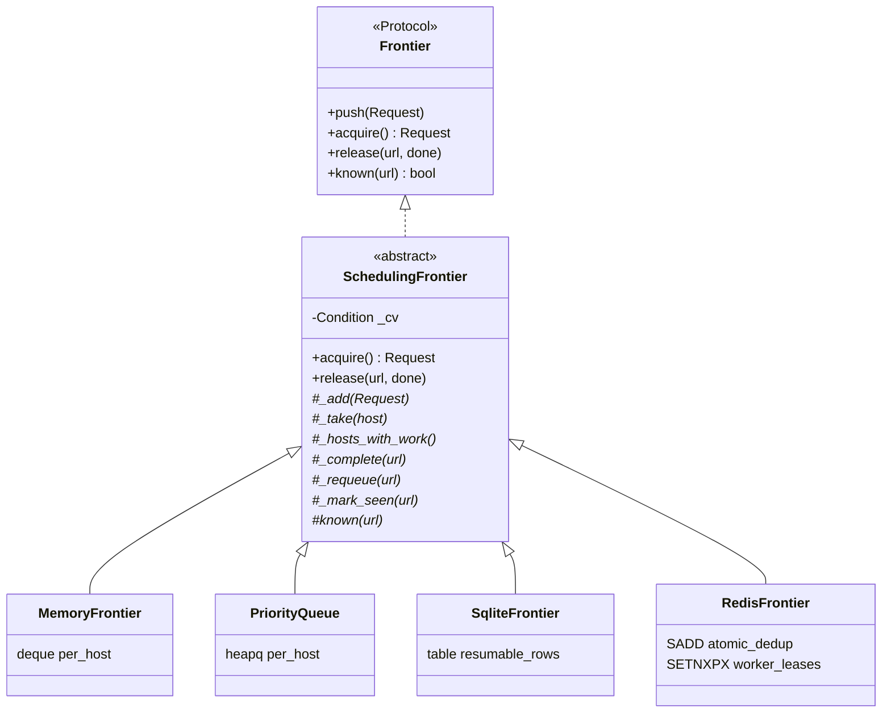
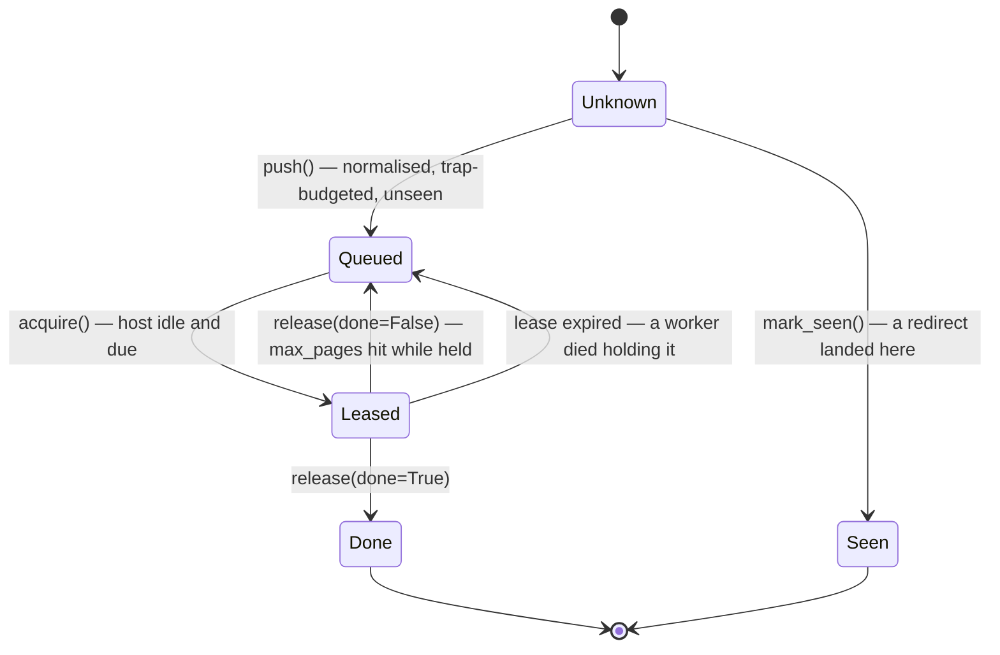
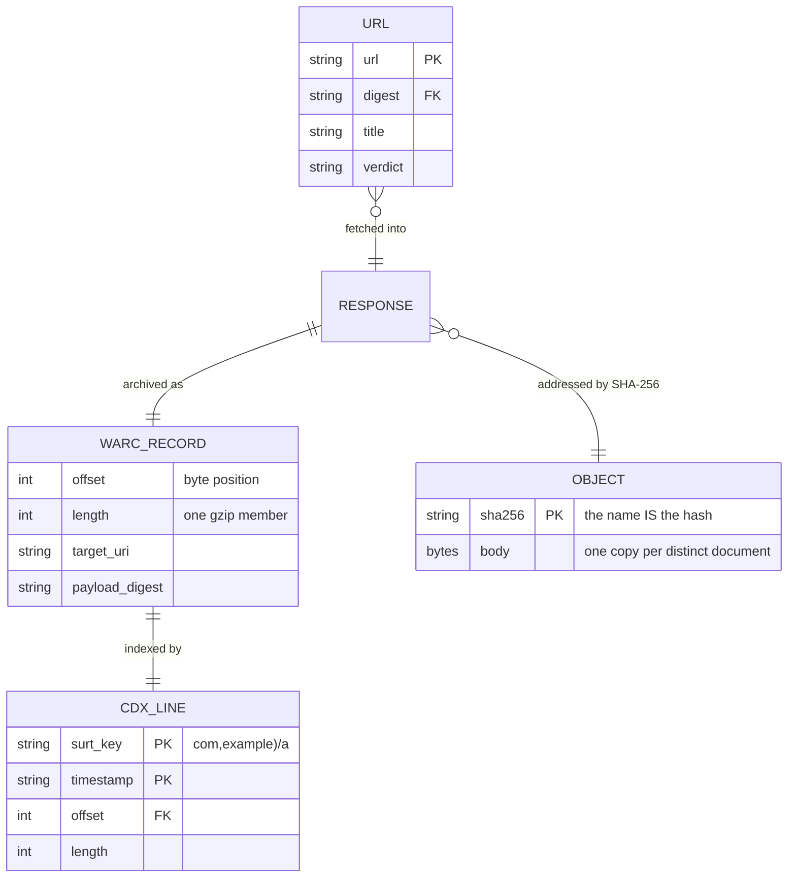
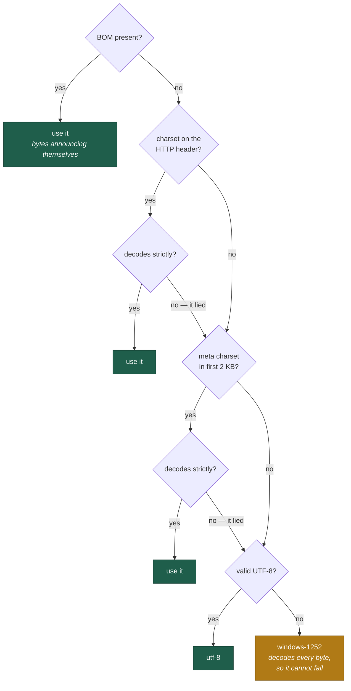

# minicrawl — high- and low-level design

Two views of the same system. The **HLD** is what the pieces are and why the
boundaries fall where they do. The **LLD** is how one URL actually travels
through them, and what each module is responsible for.

Everything here describes code in this repository. Where a design has a known
gap, it says so rather than drawing the version that would look better.

---

# Part 1 — High-level design

## 1.1 The shape of the system

A crawler is a loop with a queue in the middle. Everything else is a defence
against the ways that loop goes wrong: the same page under fourteen names, a
server that generates pages forever, a site that asks you to slow down, a
document you already have.

**Why the boundaries are here.** Three of them do real work:

| Boundary | What it buys |
|---|---|
| **Frontier is an interface, not a queue** | The same crawl runs on a deque, a heap, SQLite or Redis. Persistence and distribution become *storage* choices rather than rewrites. |
| **Gates run before the request** | robots, politeness and trap budgets can only protect you if they are consulted before bytes move. A check after the fetch is an audit, not a defence. |
| **Outputs are downstream of extraction** | The store, the archive and the index never influence the crawl. A crawl with no store behaves identically to one with a store — the `NullStore` exists to make that literal. |

## 1.2 Concurrency model

One event loop, N worker coroutines, and exactly **one in-flight request per
host**. That last constraint is the whole politeness design: it is enforced by
the frontier handing out work, not by workers agreeing to behave.

A worker never sleeps for politeness; it waits on a condition. The frontier
wakes it when some host is both idle and past its next-allowed time. So eight
workers on one host produce a **sequential, correctly spaced** crawl rather
than eight simultaneous requests, and the same eight workers across four hosts
run four at a time.

`Crawl-delay` is measured **start to start**, not slept after each fetch — the
fetch time counts toward the interval, which is why Hacker News (`Crawl-delay:
30`) takes ~90s for four pages and not ~120s.

## 1.3 Deployment views

The same crawler core is wrapped four ways. Only the wrapper changes.

The asymmetry is deliberate and is the subject of stage 14: **limits belong to
exposure, not to the crawler.** The CLI keeps `--ignore-robots` and can crawl
loopback. A public container may do neither, because the person choosing the
target is no longer the person answering for it.

## 1.4 How correctness is established

Nothing in this project is verified against the crawler's own output.

The two paths from `spec.py` never meet until the diff. The manifest is
**derived**, never written by hand, and the rule is that a crawl is never made
to pass by editing ground truth — if the corpus tolerates a wrong
implementation, the corpus is wrong too. That has been acted on four times
(stages 6, 8, 11 and 13).

---

# Part 2 — Low-level design

## 2.1 The journey of one URL

This is the hot path, in order, with the decision points that can end it early.

Two details that are easy to get wrong and are load-bearing here:

- **`release(done=...)` is not a formality.** Hitting `max_pages` while holding
  a request must release it as *unfinished*. Marking it done wrote "completed"
  to SQLite for a URL never fetched, and every resumed crawl then skipped it —
  a stage-5 bug found at stage 6.
- **A 304 has no body, so it has no links.** Caching without keeping the
  outlinks turned a 27-page crawl into a 10-page one. The freshness store
  therefore persists links, not just validators.

## 2.2 Module responsibilities

`replay.py → extract.py` closes the loop: an archived page is re-parsed by the
**same** parser the live crawl used, which is what makes the archive's fidelity
testable rather than asserted.

## 2.3 The frontier: one interface, four storages

The base class owns **all** the scheduling — host readiness, the condition
variable, the one-request-per-host rule. A subclass only answers storage
questions: put this somewhere, take one for this host, which hosts have work,
mark this done. Adding a backend is six small methods, and none of them can get
politeness wrong because none of them are asked about it.

## 2.4 The lifecycle of one URL in the frontier

The two transitions back to *Queued* are both bugs that were shipped once. A
missing requeue is invisible: the crawl finishes, reports success, and is
quietly short a page. Only diffing against declared ground truth found either.

## 2.5 What persistence stores, and how the parts refer to each other

Deduplication is not a feature here; it is a consequence of naming objects by
their content. Two identical bodies compute the same digest and therefore
occupy the same path — there is no comparison step to forget.

The CDX key is `(SURT, timestamp)`, and the pair matters: the same URL captured
twice is two rows, which is the entire reason the format exists. Writing the
index with `"w"` instead of merging silently deleted the previous crawl's
captures — the archive kept the records, and nothing could find them.

## 2.6 Character encoding, in precedence order

The strictness is the design. `errors="replace"` would honour a false
declaration and destroy the text silently; a strict failure is the only
evidence that a page lied about itself. Twelve stages shipped without this
because the corpus was entirely UTF-8 — and it went unnoticed because link
extraction survives mojibake, so crawls looked perfect while every title and
duplicate-detection fingerprint was corrupt.

## 2.7 Known gaps

Named here rather than drawn as if solved:

| Gap | Consequence |
|---|---|
| No `revisit` WARC records | An unchanged page recaptured writes a full second record. Pinned by a characterisation test. |
| No statistical charset detection | Undeclared Shift-JIS decodes to plausible Latin nonsense. Pinned by a characterisation test. |
| No `429` / `Retry-After` backoff | A rate-limited crawl at volume has no correct behaviour to fall back on. |
| CDX merge rewrites the whole index | Correct, and O(n) per crawl. A real indexer sorts externally. |
| Redirects are not re-validated against the SSRF guard | An allowlisted site redirecting to a private address is followed by the initial fetch. Narrow, because the allowlist is four fixed sites. |
